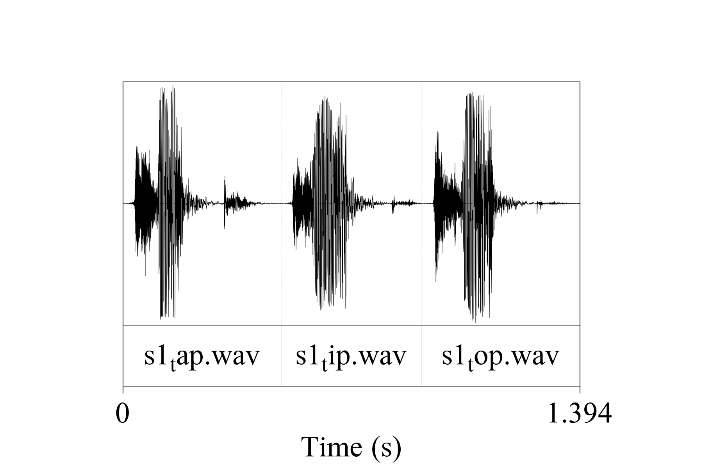
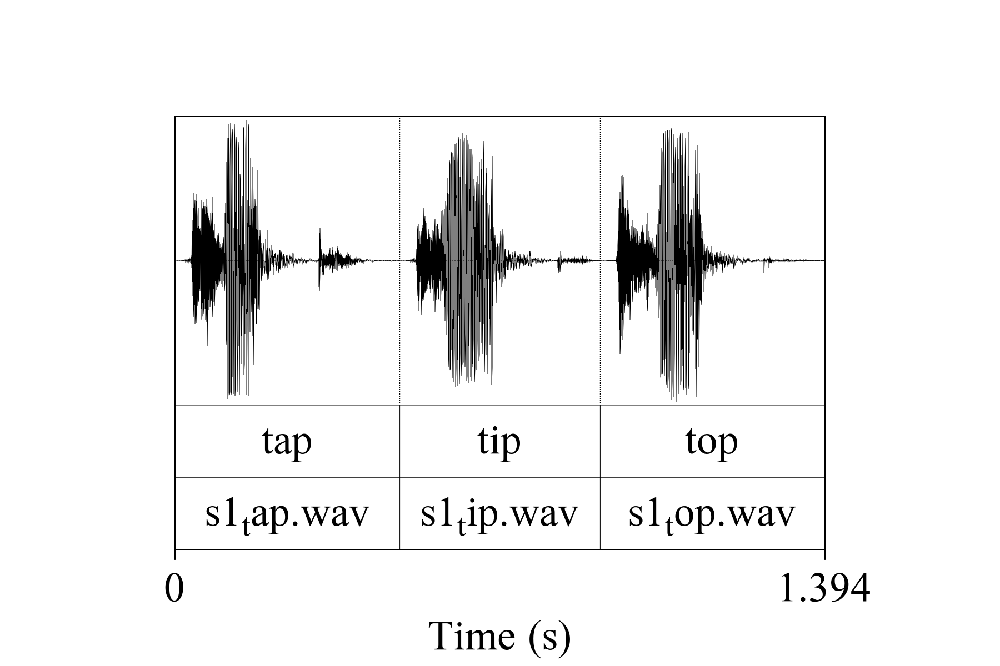
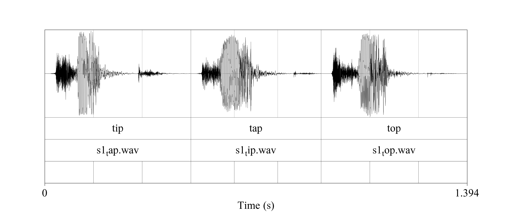
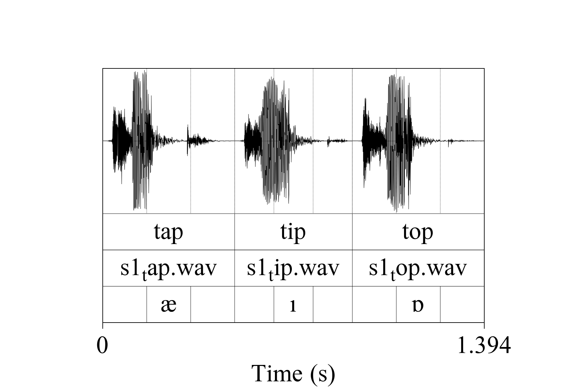

```{r, include=FALSE}
library(phonfieldwork)
# return file structure to the previous one
file.remove(c(paste0("s1/backup/", list.files("s1/backup/")),
              "s1/backup/",
              "s1/s1_all.wav",
              "s1/s1_all.TextGrid",
              "s1/s1_all.wav",
              "s1/s1_tip.png",
              paste0("s1/s1_pics/", list.files("s1/s1_pics/")),
              paste0("s1/s1_sounds/", list.files("s1/s1_sounds/")),
              "s1/s1_pics/",
              "s1/s1_sounds/",
              "s1/stimuli_viewer.html"))
rename_soundfiles(stimuli = c("02", "01", "03"),
                  path = "s2/",
                  backup = FALSE)
rename_soundfiles(stimuli = c("02", "01", "03"),
                  path = "s1/",
                  backup = FALSE)
```

# Introduction

There are a lot of different typical tasks that have to be solved during phonetic research and experiments. This includes creating a presentation that will contain all stimuli, renaming and concatenating multiple sound files recorded during a session, automatic annotation in 'Praat' TextGrids (this is one of the sound annotation standards provided by 'Praat' software, see Boersma & Weenink 2018 <http://www.fon.hum.uva.nl/praat/>), creating an html with annotation and spectrogram tables, and converting multiple formats ('Praat' TextGrid, 'EXMARaLDA' and 'ELAN'). All of these tasks can be solved by a mixture of different tools (any programming language has programs for automatic renaming, and Praat contains scripts for concatenating and renaming files, etc.). `phonfieldwork` provides a functionality that will make it easier to solve those tasks independently of any additional tools. You can also compare the functionality with other packages: ['rPraat'](https://CRAN.R-project.org/package=rPraat), ['textgRid'](https://CRAN.R-project.org/package=textgRid).

There are a lot of different books about linguistic fieldwork and experiments (e.g. @gordon03, @bowern15). This tutorial covers only the data organization part. I will focus on cases where the researcher clearly knows what she or he wants to analyze and has already created a list of stimuli that she or he wants to record. For now `phonfieldwork` works only with `.wav` and `.TextGrid` files, but I plan to extend its functionality to other types of data (e.g. Sign language videos). In the following sections I will describe my workflow for phonetic fieldwork and experiments.

# Install the package

Before you start, make sure that you have installed the package, for example with the following command:

```{r, eval = FALSE}
install.packages("phonfieldwork")
```

This command will install the last stable version of the `phonfieldwork` package from CRAN. Since CRAN runs multiple package checks before making it available, this is the safest option. Alternatively, you can download the development version from GitHub:

```{r, eval = FALSE}
install.packages("devtools")
devtools::install_github("agricolamz/phonfieldwork")
```

If you have any trouble installing the package, you will not be able to use its functionality. In that case you can create [an issue on Github](https://github.com/agricolamz/phonfieldwork/issues) or send an email. Since this package could completely destroy your data, **please do not use it until you are sure that you have made a backup**.

Use the `library()` command to load the package:
```{r}
library("phonfieldwork")
```

This tutorial was made using the following version of `phonfieldwork`:
```{r}
packageVersion("phonfieldwork")
```

This tutorial can be cited as follows:

```{r}
citation("phonfieldwork")
```

If you have any trouble using the package, do not hesitate to create [an issue on Github](https://github.com/agricolamz/phonfieldwork/issues/new).


# Philosophy of the `phonfieldwork` package

Most phonetic research consists of the following steps:

1. Formulate a research question. Think of what kind of data is necessary to answer this question, what is the appropriate amount of data, what kind of annotation you will do, what kind of statistical models and visualizations you will use, etc.
2. Create a list of stimuli.
3. Elicite list of stimuli from speakers who signed an *Informed Consent* statement, agreeing to participate in the experiment to be recorded on audio and/or video.
4. Annotate the collected data.
5. Extract the collected data.
6. Create visualizations and evaluate your statistical models.
7. Report your results.
8. Publish your data.

The `phonfieldwork` package is created for helping with items 3, partially with 4, and 5 and 8.

To make the automatic annotation of data easier, I usually record each stimulus as a separate file.  While recording, I carefully listen to my consultants to make sure that they are producing the kind of speech I want: three isolated pronunciations of the same stimulus, separated by a pause and contained in a carrier phrase. In case a speaker does not produce three clear repetitions, I ask them to repeat the task, so that as a result of my fieldwork session I will have: 

* a collection of small soundfiles
* a list of succesful and unsuccesful attempts to produce a stimulus according to my requirements (usually I keep this list in a regular notebook)

There are some phoneticians who prefer to record everything, for language documentation purposes. I think that should be a separate task: you can’t have your cake and eat it too. But if you insist on recording everything, it is possible to run two recorders at the same time: one could run during the whole session, while the other is used to produce small audio files. You can also use special software to record your stimuli automatically on a computer (e.g. [PsychoPy](https://www.psychopy.org/)).

You can show a native speaker your stimuli one by one or not show them the stimule but ask them to pronounce a certain stimulus or its translation. I use presentations to collect al stimuli in a particular order without the risk of omissions.

Since each stimulus is recorded as a separate audiofile, it is possible to merge them into one file automatically and make an annotation in a Praat TextGrid (the same result can be achieved with the `Concatenate recoverably` command in Praat). After this step, the user needs to do some annotation of her/his own. When the annotation part is finished, it is possible to extract the annotated parts to a table, where each annotated object is a row characterised by some features (stimulus, repetition, speaker, etc...). You can play the soundfile and view its oscilogram and spectrogram. Here is [an example of such a file](https://agricolamz.github.io/from_sound_to_html_viewer/create_html.html) and [instruction for doing it](https://github.com/agricolamz/from_sound_to_html_viewer).

# The `phonfieldwork` package in use
## Make a list of your stimuli

There are several ways to enter information about a list of stimuli into R:

* using the `c()` function you can create a **vector** of all words and store it in a variable `my_stimuli` (you can choose any other name):

```{r}
my_stimuli <- c("tip", "tap", "top")
```

* it is also possible to store your list as a column in a `.csv` file and read it into R using the `read.csv()` function:

```{r}
my_stimuli_df <- read.csv("my_stimuli_df.csv")
my_stimuli_df
```

* it is also possible to store your list as a column in an `.xls` or `xlsx` file and read it into R using the `read_xls` or `read_xlsx` functions from the `readxl` package. If the package `readxl` is not installed on your computer, install it using `install.packages("readxl")`

```{r}
library("readxl")
# run install.packages("readxl") in case you don't have it installed
my_stimuli_df <- read_xlsx("my_stimuli_df.xlsx")
my_stimuli_df
```

## Create a presentation based on a list of stimuli

When the list of stimuli is loaded into R, you can create a presentation for elicitation. It is important to define an output directory, so in the following example I use the `getwd()` function, which returns the path to the current working directory. You can set any directory as your current one using the `setwd()` function. It is also possible to provide a path to your intended output directory with `output_dir` (e. g. "/home/user_name/..."). This command (unlike `setwd()`) does not change your working directory.

```{r}
create_presentation(stimuli = my_stimuli_df$stimuli,
                    output_file = "first_example",
                    output_dir = getwd()) 
```

As a result, a file "first_example.html" was created in the output folder. You can change the name of this file by changing  the `output_file` argument, which looks as follows:

<iframe src="https://agricolamz.github.io/phonfieldwork/first_example.html" width = 900 height = 700>
  <p>Your browser does not support iframes :(</p>
</iframe>

It is also possible to change the output format, using the `output_format` argument. By dafault it is "html", but you can also use "pptx" (this is a relatively new feature of `rmarkdown`, so update the package in case you get errors).

## Rename collected data
After collecting data and removing soundfiles with unsuccesful elicitations, one could end up with the following structure:

```{bash, echo = FALSE}
tree | tail -n 10 | head -n 8
```

For each speaker `s1` and `s2` there is a folder that containes three audiofiles. Now let's rename the files.

```{r}
rename_soundfiles(stimuli = my_stimuli_df$stimuli,
                  prefix = "s1_",
                  path = "s1/")
```

As a result, you obtain the following structure:

```{bash, echo = FALSE}
tree | tail -n 14 | head -n 12
```

The `rename_soundfiles()` function created a back-up folder with all of the unrenamed files, and renamed all files using the prefix provided in the `prefix` argument. There is an additional argument `backup` that can be set to `FALSE` (it is `TRUE` by default), in case you are sure that the renaming function will work properly with your files and stimuli, and you do not need a back-up of the unrenamed files.

```{r}
rename_soundfiles(stimuli = my_stimuli_df$stimuli,
                  prefix = "s2_",
                  suffix = paste0("_", 1:3),
                  path = "s2/",
                  backup = FALSE)
```

```{bash, echo = FALSE}
tree | tail -n 14 | head -n 12
```

The last command renamed the soundfiles in the `s2` folder, adding the prefix `s2` as in the previous example, and the suffix `1`-`3`. On most operating systems it is impossible to create two files with the same name, so sometimes it can be useful to add some kind of index at the end of the files.

For now `phonfieldwork` works only with `.wav` files, but I will try to implement more possibilities in the future (such as ELAN .eaf and EXMARaLDA ...).

## Merge all data together

After all the files are renamed, you can merge them into one:

```{r}
concatenate_soundfiles(file_name = "s1_all",
                       path = "s1/")
```

This comand creates a new soundfile `s1_all.wav` and an asociated Praat TextGrid `s1_all.TextGrid`:

```{bash, echo = FALSE}
tree | tail -n 16 | head -n 14
```

The resulting file can be parsed with Praat:



## Annotate your data

It is possible to annotate words using an existing annotation:

```{r}
my_stimuli_df$stimuli
annotate_textgrid(annotation = my_stimuli_df$stimuli,
                  textgrid = "s1/s1_all.TextGrid")
```



As you can see in the example, the `annotate_textgrid()` function creates a backup of the tier and adds a new tier on top of the previous one. It is possible to prevent the function from doing so by setting the `backup` argument to `FALSE`.

It is possible to annotate every second (third, fourth, etc.) interval. Imagine that someone annotated each vowel in the recording, so the TextGrid will look as follows:

```{r, include=FALSE}
annotation <- read.csv("annotation_of_s1.csv")
annotation$annotation <- ""
df_to_tier(df = annotation, textgrid = "s1/s1_all.TextGrid") 
```



Now you can use the second column in `my_stimuli_df`, which contains vowels.

```{r}
my_stimuli_df$vowel
annotate_textgrid(annotation = my_stimuli_df$vowel,
                  textgrid = "s1/s1_all.TextGrid",
                  each = 2,
                  tier = 3, 
                  backup = FALSE)
```


You can see from the last figure that no backup tier was created (`backup = FALSE`), that the third tier was annotated (`tier = 3`), and that an annotation was performed in every second interval (`each = 2`).

## Extracting your data

First, it is important to create a folder where all of the extracted files will be stored:
```{r}
dir.create("s1/s1_sounds")
```

It is possible extract to extract all annotated files based on an annotation tier:

```{r}
extract_intervals(file_name = "s1/s1_all.wav", 
                  textgrid = "s1/s1_all.TextGrid",
                  tier = 3,
                  path = "s1/s1_sounds/",
                  prefix = "s1_")
```

```{bash, echo = FALSE}
tree | tail -n 19 | head -n 17
```


## Visualizing your data
It is possible to view an oscilogram and spetrogram of any soundfile:

```{r, fig.width=12, fig.height=6}
draw_sound(file_name = "s1/s1_sounds/1_s1_ı.wav")
```
  
There are additional parameters:

* `title` -- the title for the plot
* `colores` -- set to (`TRUE`) for a colored spectogram, or (`FALSE`) for greyscale. It is also possible to provide a vector of custom colors for the spectrogram.
* `maximum_frequency` -- the maximum frequency to be displayed for the spectrogram
* `dynamic_range` -- values greater than this many dB below the maximum will be displayed in the same color
* `window_length` -- the desired length in milliseconds for the analysis window 
* `output_file` -- the name of the output file
* `output_width` -- the width of the device
* `output_height` -- the height of the device
* `output_units` -- the units in which height and width are given. This can be "px" (pixels, which is the default value), "in" (inches), "cm" or "mm".

If the `output_file` argument is provided, R will save the plot in your directory instead of displaying it.

```{r}
draw_sound(file_name = "s1/s1_sounds/1_s1_ı.wav", output_file = "s1/s1_tip", title = "s1 tip")
```

```{bash, echo = FALSE}
tree | tail -n 21 | head -n 19
```

It is also possible to create visualizations of all .wav files in a folder. For this purpose you need to specify a source folder with the argument `sounds_from_folder` and a target folder for the images (`pic_folder_name`). The new image folder is automatically created in the upper level folder, so that sound and image folders are on the same level in the tree structure of your directory.

```{r}
draw_sound(sounds_from_folder = "s1/s1_sounds/", 
           pic_folder_name = "s1_pics")
```

```{bash, echo = FALSE}
tree | tail -n 25 | head -n 23
```

## Create a viewer

It is possible to create an annotation viewer.

```{r, message= FALSE, warning=FALSE}
create_viewer(audio_dir = "s1/s1_sounds/",
              picture_dir = "s1/s1_pics/", 
              textgrid = "s1/s1_all.TextGrid",
              tiers = c(1, 3),
              output_dir = "s1/",
              output_file = "stimuli_viewer")
```

As a result, a `stimuli_viewer.html` was created in the `s1` folder.

```{bash, echo = FALSE}
tree | tail -n 26 | head -n 24
```

You can find the created example [here](https://agricolamz.github.io/phonfieldwork/s1/stimuli_viewer.html).

# References
