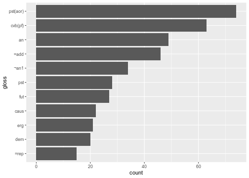

## Introduction

The output tables from the `phonfieldwork`'s functions (e. g. `textgrid_to_df()`, `eaf_to_df()`, `exb_to_df()`, `flextext_to_df()` etc.) is hard to interpret since each row is a separate morpheme/observation or aother unit. In order to merge it to a more common representation we will use `tidyverse` functions (mainly `dplyr` and `tidyr` packages). This text will help you to achieve some results, but it is better to spend some times learning data manipulation with `dplyr` and `tidyr`.

If you do not have `tidyverse` installed run:


```r
install.packages("tidyverse")
```

Let's load the package:


```r
library("tidyverse")
```


## .TextGrid, .eaf, .exb formats
The standard sound annotation formats consisnt of tiers with parallel annotation:


If we convert this file to R we will achieve something like this:


```r
textgrid_to_df("s1/s1_all.TextGrid")
#>    id time_start  time_end      content tier     tier_name          source
#> 1   1  0.0000000 0.4821542          tip    1        labels s1_all.TextGrid
#> 4   1  0.0000000 0.4821542 1_s1_tip.wav    2 backup labels s1_all.TextGrid
#> 7   1  0.0000000 0.1072426                 3               s1_all.TextGrid
#> 8   2  0.1072426 0.1887230            ı    3               s1_all.TextGrid
#> 9   3  0.1887230 0.4821542                 3               s1_all.TextGrid
#> 2   2  0.4821542 0.9120635          tap    1        labels s1_all.TextGrid
#> 5   2  0.4821542 0.9120635 2_s1_tap.wav    2 backup labels s1_all.TextGrid
#> 10  4  0.4821542 0.5770552                 3               s1_all.TextGrid
#> 11  5  0.5770552 0.6793392            æ    3               s1_all.TextGrid
#> 12  6  0.6793392 0.9120635                 3               s1_all.TextGrid
#> 3   3  0.9120635 1.3942177          top    1        labels s1_all.TextGrid
#> 6   3  0.9120635 1.3942177 3_s1_top.wav    2 backup labels s1_all.TextGrid
#> 13  7  0.9120635 1.0364661                 3               s1_all.TextGrid
#> 14  8  1.0364661 1.1066780            ɒ    3               s1_all.TextGrid
#> 15  9  1.1066780 1.3942177                 3               s1_all.TextGrid
```

As we see this table has a long format structure: each observation has its own row. We can select the first two rows with the `filter()` function, remove all unnecessary columns with the `select()` function and spread everything in a table with the `pivot_wider()` function:


```r
textgrid_to_df("s1/s1_all.TextGrid") %>% 
  filter(tier %in% 1:2) %>% 
  select(-time_start, -time_end, -tier_name) %>% 
  pivot_wider(names_from = tier, values_from = content)
#> # A tibble: 3 x 4
#>      id source          `1`   `2`         
#>   <dbl> <chr>           <chr> <chr>       
#> 1     1 s1_all.TextGrid tip   1_s1_tip.wav
#> 2     2 s1_all.TextGrid tap   2_s1_tap.wav
#> 3     3 s1_all.TextGrid top   3_s1_top.wav
```

## .flextext format

Imagine that we obtained the first result from `flextext_to_df()`:


```r
df <- flextext_to_df("files/zilo_test.flextext")
head(df)
#>   p_id s_id w_id    txt     cf hn     gls                   msa
#> 1    1    1    1     б-     б-  1      an Inflects any category
#> 2    1    1    1    ик1    ик1  1    быть                    гл
#> 3    1    1    1     -о     -о  1     pst               гл:Past
#> 4    1    1    1     -й     -й  5 cvb(pf)    гл:Converb/Perfect
#> 5    1    1    1 =гъоди =гъоди  1    =rep                  част
#> 6    1    1    2     б-     б-  1      an Inflects any category
#>                  free_trans                          text_title
#> 1 Жил-был (у Гъули?) петух. 2017.04 Fairytale about the rooster
#> 2 Жил-был (у Гъули?) петух. 2017.04 Fairytale about the rooster
#> 3 Жил-был (у Гъули?) петух. 2017.04 Fairytale about the rooster
#> 4 Жил-был (у Гъули?) петух. 2017.04 Fairytale about the rooster
#> 5 Жил-был (у Гъули?) петух. 2017.04 Fairytale about the rooster
#> 6 Жил-был (у Гъули?) петух. 2017.04 Fairytale about the rooster
#>                                  morph                                 word
#> 1 d7f713db-e8cf-11d3-9764-00c04f186933 efafb420-e203-4685-9be2-1b7810f10a70
#> 2 d7f713e8-e8cf-11d3-9764-00c04f186933 efafb420-e203-4685-9be2-1b7810f10a70
#> 3 d7f713dd-e8cf-11d3-9764-00c04f186933 efafb420-e203-4685-9be2-1b7810f10a70
#> 4 d7f713dd-e8cf-11d3-9764-00c04f186933 efafb420-e203-4685-9be2-1b7810f10a70
#> 5 d7f713e1-e8cf-11d3-9764-00c04f186933 efafb420-e203-4685-9be2-1b7810f10a70
#> 6 d7f713db-e8cf-11d3-9764-00c04f186933 c76d26b7-b84a-42a8-ba34-38e712b1db13
#>                                 phrase                            paragraph
#> 1 1cbadc4f-4051-4783-a0d8-bfeee2d2fb13 0c9ffe63-b4bf-4af3-a1da-f68567e03513
#> 2 1cbadc4f-4051-4783-a0d8-bfeee2d2fb13 0c9ffe63-b4bf-4af3-a1da-f68567e03513
#> 3 1cbadc4f-4051-4783-a0d8-bfeee2d2fb13 0c9ffe63-b4bf-4af3-a1da-f68567e03513
#> 4 1cbadc4f-4051-4783-a0d8-bfeee2d2fb13 0c9ffe63-b4bf-4af3-a1da-f68567e03513
#> 5 1cbadc4f-4051-4783-a0d8-bfeee2d2fb13 0c9ffe63-b4bf-4af3-a1da-f68567e03513
#> 6 1cbadc4f-4051-4783-a0d8-bfeee2d2fb13 0c9ffe63-b4bf-4af3-a1da-f68567e03513
#>                                   text
#> 1 f08dd466-fca6-4597-925c-c46309387ef7
#> 2 f08dd466-fca6-4597-925c-c46309387ef7
#> 3 f08dd466-fca6-4597-925c-c46309387ef7
#> 4 f08dd466-fca6-4597-925c-c46309387ef7
#> 5 f08dd466-fca6-4597-925c-c46309387ef7
#> 6 f08dd466-fca6-4597-925c-c46309387ef7
```

As we can see from `df` print there are three indices in the dataset: `p_id` -- paragraph id, `s_id` -- sentence id and `w_id` -- word id.


```r
df %>% 
  filter(free_trans != "") %>% 
  select(p_id, s_id, w_id, txt, gls, free_trans) %>% 
  group_by(p_id, s_id, free_trans, w_id) %>% 
  summarise(txt = str_c(txt, collapse = ""),
         gls = str_c(gls, collapse = "-"))
#> `summarise()` regrouping output by 'p_id', 's_id', 'free_trans' (override with `.groups` argument)
#> # A tibble: 136 x 6
#> # Groups:   p_id, s_id, free_trans [19]
#>     p_id  s_id free_trans                    w_id txt            gls                   
#>    <dbl> <dbl> <chr>                        <dbl> <chr>          <chr>                 
#>  1     1     1 Жил-был (у Гъули?) петух.        1 б-ик1-о-й=гъо… "an-быть-pst-cvb(pf)-…
#>  2     1     1 Жил-был (у Гъули?) петух.        2 б--о-ч1игу=гъ… "an--pst-neg.cvb-=rep"
#>  3     1     1 Жил-был (у Гъули?) петух.        3 Гъули-б        "Гъули-an(gen)"       
#>  4     1     1 Жил-был (у Гъули?) петух.        4 х1елеко        "петух"               
#>  5     1     1 Жил-был (у Гъули?) петух.        5 .              ""                    
#>  6     2     2 Он грелся на улице(?).           6 къват1и-ла=гъ… "улица-in-=rep"       
#>  7     2     2 Он грелся на улице(?).           7 б-ик1-о-j      "an-быть-pst-cvb(pf)" 
#>  8     2     2 Он грелся на улице(?).           8 букьир-ъа      "Букир-sup"           
#>  9     2     2 Он грелся на улице(?).           9 .              ""                    
#> 10     2     3 [Ему в ногу] воткнулась кол…    10 къинни-й=гъоди "втыкаться-cvb(pf)-=r…
#> # … with 126 more rows
```

The first `filter()` removes some garbage rows that are present in our example flextext. The `select()` function selects only six important columns from 15 presented in the dataset. The `group_by()` and `summarise()` merge all text from `txt` variable and all glosses from `gls` variable together. Pipe operater `%>% ` make it possible to pass the result from the previous funstion as an input to the following one.

So now we can use the same code in order to merge everything into sentences:


```r
df %>% 
  filter(free_trans != "") %>% 
  select(p_id, s_id, w_id, txt, gls, free_trans) %>% 
  group_by(p_id, s_id, free_trans, w_id) %>% 
  summarise(txt = str_c(txt, collapse = ""),
         gls = str_c(gls, collapse = "-")) %>% 
  group_by(p_id, s_id, free_trans) %>% 
  summarise(txt = str_c(txt, collapse = " "),
         gls = str_c(gls, collapse = " "))
#> `summarise()` regrouping output by 'p_id', 's_id', 'free_trans' (override with `.groups` argument)
#> `summarise()` regrouping output by 'p_id', 's_id' (override with `.groups` argument)
#> # A tibble: 19 x 5
#> # Groups:   p_id, s_id [19]
#>     p_id  s_id free_trans                 txt                    gls                   
#>    <dbl> <dbl> <chr>                      <chr>                  <chr>                 
#>  1     1     1 "Жил-был (у Гъули?) петух… б-ик1-о-й=гъоди б--о-… "an-быть-pst-cvb(pf)-…
#>  2     2     2 "Он грелся на улице(?)."   къват1и-ла=гъоди б-ик… "улица-in-=rep an-быт…
#>  3     2     3 "[Ему в ногу] воткнулась … къинни-й=гъоди ццана . "втыкаться-cvb(pf)-=r…
#>  4     3     4 "Когда колючка воткнулась… ццана къинни-рбигьи б… "колючка втыкаться-ps…
#>  5     4     5 "Гъули не обнаружил дома … бихьтай=ло ишуишу й-и… "Бихтай-=add дома-дом…
#>  6     5     6 "Оттуда пошел к Умалаю, "  б-uʔ-oн-ни=гъоди гьер… "an-идти-pst-pst(aor)…
#>  7     6     7 "Оттуда петух пошел к Пат… х1елеко гье-лъу-кку б… "петух dem-dat-el an-…
#>  8     8    10 "Оттуда [петух] пошел к Х… гье-лъу-кку б--и-й б-… "dem-dat-el an--pst(a…
#>  9     9    11 "Иди к Хурмат, ..."        хъаничай-ди=ло ен-л1и… "Ханичай-erg-=add rfl…
#> 10    10    12 "Когда дошёл до двора Хур… рул1-и-й Х1урмати-л1и… "говорить--cvb(pf) Ху…
#> 11    11    13 "Три дня не ели, мы с ней… рул1-и-й лъоб-гу зубу… "говорить--cvb(pf) тр…
#> 12    12    14 "Оттуда он ушёл и дошёл д… гье-лъу-кку б--и-йб--… "dem-dat-el an--pst(a…
#> 13    13    15 "Захраил …?"               й--и-й Загьраъил-ди=л… "f--pst(aor)-cvb(pf) …
#> 14    14    16 "И он пошел в село. Захра… б-укъ-и-й гьеге-б=ло … "an-гнать-pst-pf dem-…
#> 15    15    17 "Оттуда снизу вверх к Иср… гьегелъу-кку гьикьу=л… "там-el внизу-=add вв…
#> 16    16    18 "Шли-шли и пришли к Гаджи… гье-лъу-кку б--и-йб--… "dem-dat-el an--pst(a…
#> 17    17    19 "Они поссорились (?) и пр… й-ейхъ-у й-ах-о-й дун… "f-ругать-pst f-драть…
#> 18    18    20 "Когда закончили ссоритьс… джид-ия сабаб=ло б-ул… "делать-fut причина-=…
#> 19    19    21 "На воротах Забита петух … х1елеко б--и-й забити… "петух an--pst(aor)-c…
```

It is also very easy to get some simple statistics from the data:


```r
df %>% 
  filter(gls != "") %>% 
  count(gls) %>% 
  top_n(6)
#> Selecting by n
#>        gls  n
#> 1     =add 46
#> 2     ¬an1 34
#> 3       an 49
#> 4  cvb(pf) 63
#> 5      pst 28
#> 6 pst(aor) 74
```

Here with the `filter()` function we remove all empty glosses, then we calculate and sort them according to frequency, and in the end we take top six glosses with the `top_n()` function. We can even visualis it with the `ggplot2` package:


```r
df %>% 
  filter(gls != "") %>% 
  count(gls) %>% 
  top_n(11) %>% 
  ggplot(aes(n, fct_reorder(gls, n)))+
  geom_col()+
  labs(x = "count", y = "gloss")
#> Selecting by n
```



