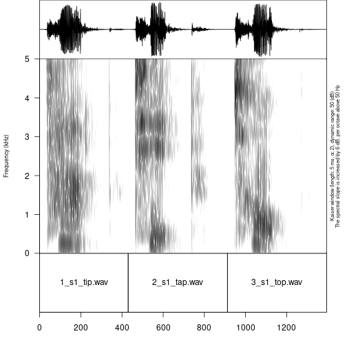
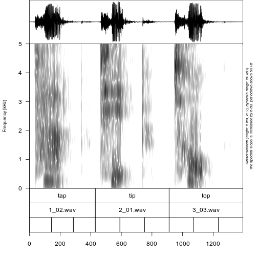
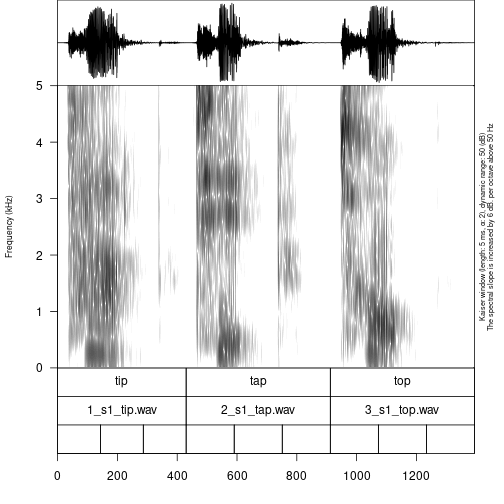
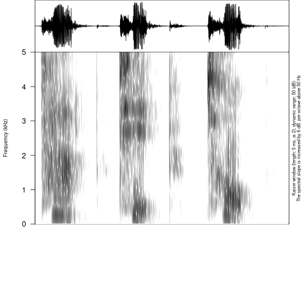
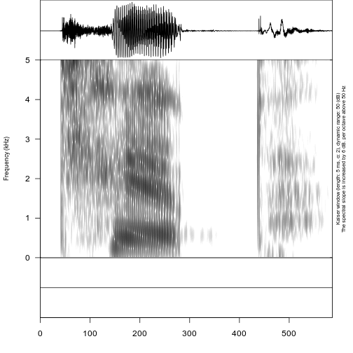
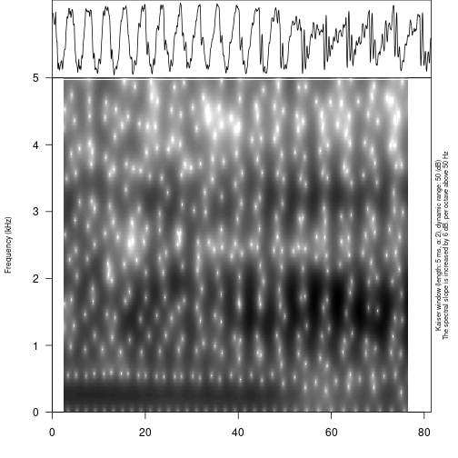
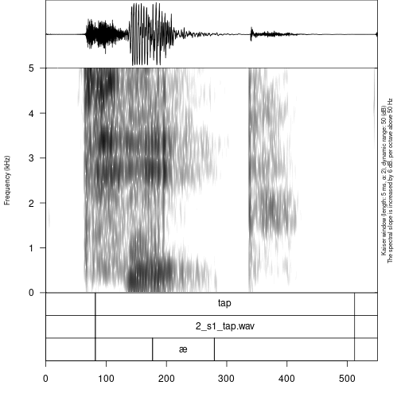
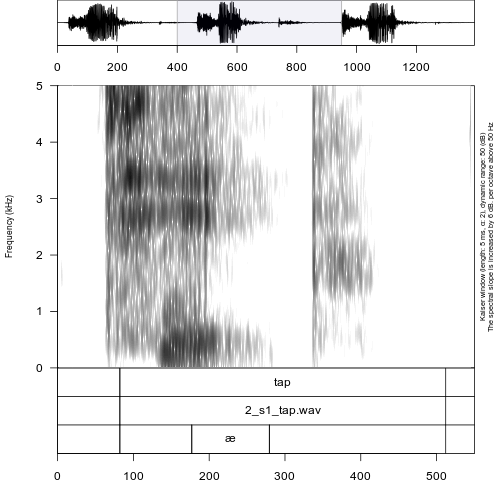

# Introduction

There are a lot of different typical tasks that have to be solved during phonetic research and experiments. This includes creating a presentation that will contain all stimuli, renaming and concatenating multiple sound files recorded during a session, automatic annotation in 'Praat' TextGrids (this is one of the sound annotation standards provided by 'Praat' software, see Boersma & Weenink 2020 <https://www.fon.hum.uva.nl/praat/>), creating an html table with annotations and spectrograms, and converting multiple formats ('Praat' TextGrid, 'EXMARaLDA' @schmidt09 and 'ELAN' @wittenburg06). All of these tasks can be solved by a mixture of different tools (any programming language has programs for automatic renaming, and Praat contains scripts for concatenating and renaming files, etc.). `phonfieldwork` provides a functionality that will make it easier to solve those tasks independently of any additional tools. You can also compare the functionality with other packages: ['rPraat'](https://CRAN.R-project.org/package=rPraat) @boril16, ['textgRid'](https://CRAN.R-project.org/package=textgRid) @reidy16, ['pympi'](https://dopefishh.github.io/pympi/index.html) @lubbers13 (thx to Lera Dushkina and Anya Klezovich for letting me know about `pympi`).

There are a lot of different books about linguistic fieldwork and experiments (e.g. @gordon03, @bowern15). This tutorial covers only the data organization part. I will focus on cases where the researcher clearly knows what she or he wants to analyze and has already created a list of stimuli that she or he wants to record. For now `phonfieldwork` works only with `.wav(e)` and `.mp3` audiofiles and `.TextGrid`, `.eaf`, `.exb`, `.srt`, Audacity `.txt` and `.flextext` annotation formats, but the main functionality is availible for `.TextGrid` files (I plan to extend its functionality to other types of data). In the following sections I will describe my workflow for phonetic fieldwork and experiments.

# Install the package

Before you start, make sure that you have installed the package, for example with the following command:


```r
install.packages("phonfieldwork")
```

This command will install the last stable version of the `phonfieldwork` package from CRAN. Since CRAN runs multiple package checks before making it available, this is the safest option. Alternatively, you can download the development version from GitHub:


```r
install.packages("remotes")
remotes::install_github("ropensci/phonfieldwork")
```

If you have any trouble installing the package, you will not be able to use its functionality. In that case you can create [an issue on Github](https://github.com/ropensci/phonfieldwork/issues) or send an email. Since this package could completely destroy your data, **please do not use it until you are sure that you have made a backup**.

Use the `library()` command to load the package:

```r
library("phonfieldwork")
```
In order to work with some `rmarkdown` functions you will need to install `pandoc`, see `vignette("pandoc")` for the details.

This tutorial was made using the following version of `phonfieldwork`:

```r
packageVersion("phonfieldwork")
```

```
## [1] '0.0.12'
```

This tutorial can be cited as follows:

```r
citation("phonfieldwork")
```

```
## 
## To cite package 'phonfieldwork' in publications use:
## 
##   Moroz G (2020). _Phonetic fieldwork and experiments with phonfieldwork package_.
##   <https://CRAN.R-project.org/package=phonfieldwork>.
## 
## A BibTeX entry for LaTeX users is
## 
##   @Manual{,
##     title = {Phonetic fieldwork and experiments with phonfieldwork package},
##     author = {George Moroz},
##     year = {2020},
##     url = {https://CRAN.R-project.org/package=phonfieldwork},
##   }
```

If you have any trouble using the package, do not hesitate to create [an issue on Github](https://github.com/ropensci/phonfieldwork/issues/new).


# Philosophy of the `phonfieldwork` package

Most phonetic research consists of the following steps:

1. Formulate a research question. Think of what kind of data is necessary to answer this question, what is the appropriate amount of data, what kind of annotation you will do, what kind of statistical models and visualizations you will use, etc.
2. Create a list of stimuli.
3. Elicite list of stimuli from speakers who signed an *Informed Consent* statement, agreeing to participate in the experiment to be recorded on audio and/or video. Keep an eye on recording settings: sampling rate, resolution (bit), and number of channels should be the same across all recordings.
4. Annotate the collected data.
5. Extract the collected data.
6. Create visualizations and evaluate your statistical models.
7. Report your results.
8. Publish your data.

The `phonfieldwork` package is created for helping with items 3, partially with 4, and 5 and 8.

To make the automatic annotation of data easier, I usually record each stimulus as a separate file.  While recording, I carefully listen to my consultants to make sure that they are producing the kind of speech I want: three isolated pronunciations of the same stimulus, separated by a pause and contained in a carrier phrase. In case a speaker does not produce three clear repetitions, I ask them to repeat the task, so that as a result of my fieldwork session I will have:

* a collection of small soundfiles (video) with the same sampling rate, resolution (bit), and number of channels
* a list of succesful and unsuccesful attempts to produce a stimulus according to my requirements (usually I keep this list in a regular notebook)

There are some phoneticians who prefer to record everything, for language documentation purposes. I think that should be a separate task: you can’t have your cake and eat it too. But if you insist on recording everything, it is possible to run two recorders at the same time: one could run during the whole session, while the other is used to produce small audio files. You can also use special software to record your stimuli automatically on a computer (e.g. [SpeechRecorder](https://www.bas.uni-muenchen.de/Bas/software/speechrecorder/) or [PsychoPy](https://www.psychopy.org/)).

You can show a native speaker your stimuli one by one or not show them the stimule but ask them to pronounce a certain stimulus or its translation. I use presentations to collect all stimuli in a particular order without the risk of omissions.

Since each stimulus is recorded as a separate audiofile, it is possible to merge them into one file automatically and make an annotation in a Praat TextGrid (the same result can be achieved with the `Concatenate recoverably` command in Praat). After this step, the user needs to do some annotation of her/his own. When the annotation part is finished, it is possible to extract the annotated parts to a table, where each annotated object is a row characterised by some features (stimulus, repetition, speaker, etc...). You can play the soundfile and view its oscilogram and spectrogram. Here is [an example of such a file](https://ropensci.github.io/phonfieldwork/additional/stimuli_viewer.html) and [instruction for doing it](https://ropensci.github.io/phonfieldwork/articles/phonfieldwork.html#create-a-viewer-1).

# The `phonfieldwork` package in use
## Make a list of your stimuli

There are several ways to enter information about a list of stimuli into R:

* using the `c()` function you can create a **vector** of all words and store it in a variable `my_stimuli` (you can choose any other name):


```r
my_stimuli <- c("tip", "tap", "top")
```

* it is also possible to store your list as a column in a `.csv` file and read it into R using the `read.csv()` function:


```r
my_stimuli_df <- read.csv("my_stimuli_df.csv")
my_stimuli_df
```

```
##   stimuli vowel
## 1     tip     ı
## 2     tap     æ
## 3     top     ɒ
```

* it is also possible to store your list as a column in an `.xls` or `xlsx` file and read it into R using the `read_xls` or `read_xlsx` functions from the `readxl` package. If the package `readxl` is not installed on your computer, install it using `install.packages("readxl")`


```r
library("readxl")
# run install.packages("readxl") in case you don't have it installed
my_stimuli_df <- read_xlsx("my_stimuli_df.xlsx")
my_stimuli_df
```

```
## # A tibble: 3 × 2
##   stimuli vowel
##   <chr>   <chr>
## 1 tip     ı    
## 2 tap     æ    
## 3 top     ɒ
```

## Create a presentation based on a list of stimuli

When the list of stimuli is loaded into R, you can create a presentation for elicitation. It is important to define an output directory, so in the following example I use the `getwd()` function, which returns the path to the current working directory. You can set any directory as your current one using the `setwd()` function. It is also possible to provide a path to your intended output directory with `output_dir` (e. g. "/home/user_name/..."). This command (unlike `setwd()`) does not change your working directory.


```r
create_presentation(stimuli = my_stimuli_df$stimuli,
                    output_file = "first_example",
                    output_dir = getwd())
```

As a result, a file "first_example.html" was created in the output folder. You can change the name of this file by changing  the `output_file` argument. The `.html` file now looks as follows:

<iframe src="https://ropensci.github.io/phonfieldwork/additional/first_example.html" width = 800 height = 600>
  <p>Your browser does not support iframes :(</p>
</iframe>

It is also possible to change the output format, using the `output_format` argument. By dafault it is "html", but you can also use "pptx" (this is a relatively new feature of `rmarkdown`, so update the package in case you get errors). There is also an additional argument `translations`, where you can provide translations for stimuli in order that they appeared near the stimuli on the slide.

It is also possible to use images (or gif, e. g. for a sign language research) as a stimuli. In order to do that you need to provide an absolute or relative path to the file instead of the stimulus and mark in the `external` argument, which of the stimuli is external:


```r
my_image <- system.file("extdata", "r-logo.png", package = "phonfieldwork")
my_image
```

```
## [1] "/home/agricolamz/R/x86_64-pc-linux-gnu-library/4.2/phonfieldwork/extdata/r-logo.png"
```

```r
create_presentation(stimuli = c("rzeka", "drzewo", my_image),
                    external = 3,
                    output_file = "second_example",
                    output_dir = getwd())
```

<iframe src="https://ropensci.github.io/phonfieldwork/additional/second_example.html" width = 800 height = 600>
  <p>Your browser does not support iframes :(</p>
</iframe>

## Rename collected data
After collecting data and removing soundfiles with unsuccesful elicitations, one could end up with the following structure:


```
## ├── s1
## │   ├── 01.wav
## │   ├── 02.wav
## │   └── 03.wav
## ├── s2
## │   ├── 01.wav
## │   ├── 02.wav
## │   └── 03.wav
```

For each speaker `s1` and `s2` there is a folder that containes three audiofiles. Now let's rename the files.


```r
rename_soundfiles(stimuli = my_stimuli_df$stimuli,
                  prefix = "s1_",
                  path = "s1/")
```

```
## You can find change correspondences in the following file:
## /home/agricolamz/work/packages/phonfieldwork/vignettes/s1/backup/logging.csv
```

As a result, you obtain the following structure:


```
## ├── s1
## │   ├── 1_s1_tip.wav
## │   ├── 2_s1_tap.wav
## │   ├── 3_s1_top.wav
## │   └── backup
## │       ├── 01.wav
## │       ├── 02.wav
## │       ├── 03.wav
## │       └── logging.csv
## ├── s2
## │   ├── 01.wav
## │   ├── 02.wav
## │   └── 03.wav
```

The `rename_soundfiles()` function created a backup folder with all of the unrenamed files, and renamed all files using the prefix provided in the `prefix` argument. There is an additional argument `backup` that can be set to `FALSE` (it is `TRUE` by default), in case you are sure that the renaming function will work properly with your files and stimuli, and you do not need a backup of the unrenamed files. There is also an additional argument `logging` (`TRUE` by default) that creates a `logging.csv` file in the `backup` folder (or in the original folder if the `backup` argument has value `FALSE`) with the correspondences between old and new names of the files. Here is the contence of the `logging.csv`:


```
##     from           to
## 1 01.wav 1_s1_tip.wav
## 2 02.wav 2_s1_tap.wav
## 3 03.wav 3_s1_top.wav
```

To each name was added an additional prefix with number that make it easear to keep the original sorting of the stimuli. If you do not want this autonumbering turn the `autonumbering` to `FALSE`:


```r
rename_soundfiles(stimuli = my_stimuli_df$stimuli,
                  prefix = "s2_",
                  suffix = paste0("_", 1:3),
                  path = "s2/",
                  backup = FALSE,
                  logging = FALSE,
                  autonumbering = FALSE)
```


```
## ├── s1
## │   ├── 1_s1_tip.wav
## │   ├── 2_s1_tap.wav
## │   ├── 3_s1_top.wav
## │   └── backup
## │       ├── 01.wav
## │       ├── 02.wav
## │       ├── 03.wav
## │       └── logging.csv
## ├── s2
## │   ├── s2_tap_2.wav
## │   ├── s2_tip_1.wav
## │   └── s2_top_3.wav
```

The last command renamed the soundfiles in the `s2` folder, adding the prefix `s2` as in the previous example, and the suffix `1`-`3`. On most operating systems it is impossible to create two files with the same name, so sometimes it can be useful to add some kind of index at the end of the files.

There is also a possible scenario, that not all stimuli are retrieved from informant. So in order to deal with that case there is an additional argument `missing`, where user can put id numbers of stimuli that are not present in audiofiles:


```r
rename_soundfiles(stimuli = my_stimuli_df$stimuli,
                  path = "s3/",
                  missing = c(1, 3))
```

Sometimes it is useful to get information about sound duration:


```r
get_sound_duration("s1/2_s1_tap.wav")
```

```
##           file  duration
## 1 2_s1_tap.wav 0.4299093
```

It is also possible to analyze the whole folder using the `read_from_folder()` function. The first argument is the path to the folder. The second argument is the type of information or file type (possible values: "audacity", "duration", "eaf", "exb", "flextext", "formant", "intensity", "picth", "srt", "textgrid"):


```r
read_from_folder(path = "s2/", "duration")
```

```
##           file  duration
## 1 s2_tap_2.wav 0.5343991
## 2 s2_tip_1.wav 0.5866440
## 3 s2_top_3.wav 0.6650113
```

For now `phonfieldwork` works only with `.wav(e)` and `.mp3` sound files.

## Merge all data together

After all the files are renamed, you can merge them into one. Remmber that sampling rate, resolution (bit), and number of channels should be the same across all recordings. It is possible to resample files with the `resample()` function from  `biacoustics`.


```r
concatenate_soundfiles(path = "s1/",
                       result_file_name = "s1_all")
```

This comand creates a new soundfile `s1_all.wav` and an asociated Praat TextGrid `s1_all.TextGrid`:


```
## ├── s1
## │   ├── 1_s1_tip.wav
## │   ├── 2_s1_tap.wav
## │   ├── 3_s1_top.wav
## │   ├── backup
## │   │   ├── 01.wav
## │   │   ├── 02.wav
## │   │   ├── 03.wav
## │   │   └── logging.csv
## │   ├── s1_all.TextGrid
## │   └── s1_all.wav
## ├── s2
## │   ├── s2_tap_2.wav
## │   ├── s2_tip_1.wav
## │   └── s2_top_3.wav
```

The resulting file can be parsed with Praat:



Sometimes recorded sounds do not have any silence at the beginning or the end, so after the merging the result utterances will too close to each other. It is possible to fix using the argument `separate_duration` of the `concatenate_soundfiles()` function: just put the desired duration of the separator in seconds.

It is not kind of task that could occur within phonfieldwork philosophy, but it also possible to merge multiple `.TextGrid`s with the same tier structure using `concatente_textgrids()` function.

## Annotate your data

It is possible to annotate words using an existing annotation:


```r
my_stimuli_df$stimuli
```

```
## [1] "tip" "tap" "top"
```

```r
annotate_textgrid(annotation =  my_stimuli_df$stimuli,
                  textgrid = "s1/s1_all.TextGrid")
```



As you can see in the example, the `annotate_textgrid()` function creates a backup of the tier and adds a new tier on top of the previous one. It is possible to prevent the function from doing so by setting the `backup` argument to `FALSE`.

Imagine that we are interested in annotation of vowels. The most common solution will be open Praat and create new annotations. But it is also possible to create them in advance using subannotations. The idea that you choose some baseline tier that later will be automatically cutted into smaller pieces on the other tier.


```r
create_subannotation(textgrid = "s1/s1_all.TextGrid",
                     tier = 1, # this is a baseline tier
                     n_of_annotations = 3) # how many empty annotations per unit?
```



It is worth mentioning that if you want to have different number of subannotation per unit, you can pass a vector of required numbers to `n_of_annotations` argument.

After the creation of subannotations, we can annotate created tier:


```r
annotate_textgrid(annotation = c("", "ı", "", "", "æ", "", "", "ɒ", ""),
                  textgrid = "s1/s1_all.TextGrid",
                  tier = 3,
                  backup = FALSE)
```



You can see that we created a third tier with annotation. The only thing left is to move annotation boundaries in Praat (this can not be automated):


You can see from the last figure that no backup tier was created (`backup = FALSE`), that the third tier was annotated (`tier = 3`).

In case you want to create an empty TextGrid it is possible to use a `create_empty_textgrid()` function that takes a duration as an argument:


```r
create_empty_textgrid(get_sound_duration("s2/s2_tip_1.wav")$duration,
                      tier_name = c("a", "b"),
                      path = "s2",
                      result_file_name = "s2_tip_1")
```


```
## ├── s1
## │   ├── 1_s1_tip.wav
## │   ├── 2_s1_tap.wav
## │   ├── 3_s1_top.wav
## │   ├── backup
## │   │   ├── 01.wav
## │   │   ├── 02.wav
## │   │   ├── 03.wav
## │   │   └── logging.csv
## │   ├── s1_all.TextGrid
## │   └── s1_all.wav
## ├── s2
## │   ├── s2_tap_2.wav
## │   ├── s2_tip_1.TextGrid
## │   ├── s2_tip_1.wav
## │   └── s2_top_3.wav
```

It is also possible to remove some tier from textgrid. For instance, we can remove one tier from the previously created file:


```r
remove_textgrid_tier(textgrid = "s2/s2_tip_1.TextGrid", tier = 2)
```


## Extracting your data

First, it is important to create a folder where all of the extracted files will be stored:

```r
dir.create("s1/s1_sounds")
```

It is possible to extract all annotated files based on an annotation tier:


```r
extract_intervals(file_name = "s1/s1_all.wav",
                  textgrid = "s1/s1_all.TextGrid",
                  tier = 3,
                  path = "s1/s1_sounds/",
                  prefix = "s1_")
```


```
## ├── s1
## │   ├── 1_s1_tip.wav
## │   ├── 2_s1_tap.wav
## │   ├── 3_s1_top.wav
## │   ├── backup
## │   │   ├── 01.wav
## │   │   ├── 02.wav
## │   │   ├── 03.wav
## │   │   └── logging.csv
## │   ├── s1_all.TextGrid
## │   ├── s1_all.wav
## │   └── s1_sounds
## │       ├── 1_s1_ı.wav
## │       ├── 2_s1_æ.wav
## │       └── 3_s1_ɒ.wav
## ├── s2
## │   ├── s2_tap_2.wav
## │   ├── s2_tip_1.TextGrid
## │   ├── s2_tip_1.wav
## │   └── s2_top_3.wav
```

## Visualizing your data
It is possible to view an oscilogram and spetrogram of any soundfile:


```r
draw_sound(file_name = "s1/s1_sounds/1_s1_ı.wav")
```



There are additional parameters:

* `title` -- the title for the plot
* `from` -- time in seconds at which to start extraction
* `to` -- time in seconds at which to stop extraction
* `zoom` -- time in seconds for zooming spectrogram
* `text_size` -- size of the text on the plot
* `annotation` -- the optional file with the TextGrid's file path or dataframe with annotations (see the section 5.)
* `freq_scale` -- the measure of the frequency: can be "Hz" or "kHz".
* `frequency_range` -- the frequency range to be displayed for the spectrogram
* `dynamic_range` -- values greater than this many dB below the maximum will be displayed in the same color
* `window_length` -- the desired length in milliseconds for the analysis window
* `window` -- window type (can be "rectangular", "hann", "hamming", "cosine", "bartlett", "gaussian", and "kaiser")
* `preemphasisf` -- Preemphasis of 6 dB per octave is added to frequencies above the specified frequency. For no preemphasis (important for bioacoustics), set to a 0.
* `spectrum_info` -- logical value, if `FALSE` won't print information about spectorgram on the right side of the plot.
* `output_file` -- the name of the output file
* `output_width` -- the width of the device
* `output_height` -- the height of the device
* `output_units` -- the units in which height and width are given. This can be "px" (pixels, which is the default value), "in" (inches), "cm" or "mm".

It is really important in case you have a long file not to draw the whole file, since it won't fit into the RAM of your computer. So you can use `from` and `to` arguments in order to plot the fragment of the sound and annotation:


```r
draw_sound("s1/s1_all.wav",
           "s1/s1_all.TextGrid",
           from = 0.4,
           to = 0.95)
```

```
## Warning in df$tier == unique(df$tier): longer object length is not a multiple of shorter object length
```



It is also possible using the `zoom` argument to show the part of the spectrogram keeping the broader oscilogram context:


```r
draw_sound("s1/s1_all.wav",
           "s1/s1_all.TextGrid",
           zoom = c(0.4, 0.95))
```

```
## Warning in df$tier == unique(df$tier): longer object length is not a multiple of shorter object length
```



If the `output_file` argument is provided, R will save the plot in your directory instead of displaying it.


```r
draw_sound(file_name = "s1/s1_sounds/1_s1_ı.wav",
           output_file = "s1/s1_tip",
           title = "s1 tip")
```


```
## ├── s1
## │   ├── 1_s1_tip.wav
## │   ├── 2_s1_tap.wav
## │   ├── 3_s1_top.wav
## │   ├── backup
## │   │   ├── 01.wav
## │   │   ├── 02.wav
## │   │   ├── 03.wav
## │   │   └── logging.csv
## │   ├── s1_all.TextGrid
## │   ├── s1_all.wav
## │   ├── s1_sounds
## │   │   ├── 1_s1_ı.wav
## │   │   ├── 2_s1_æ.wav
## │   │   └── 3_s1_ɒ.wav
## │   └── s1_tip.png
## ├── s2
## │   ├── s2_tap_2.wav
## │   ├── s2_tip_1.TextGrid
## │   ├── s2_tip_1.wav
## │   └── s2_top_3.wav
```

It is also possible to create visualizations of all sound files in a folder. For this purpose you need to specify a source folder with the argument `sounds_from_folder` and a target folder for the images (`pic_folder_name`). The new image folder is automatically created in the upper level folder, so that sound and image folders are on the same level in the tree structure of your directory.


```r
draw_sound(sounds_from_folder = "s1/s1_sounds/",
           pic_folder_name = "s1_pics")
```


```
## ├── s1
## │   ├── 1_s1_tip.wav
## │   ├── 2_s1_tap.wav
## │   ├── 3_s1_top.wav
## │   ├── backup
## │   │   ├── 01.wav
## │   │   ├── 02.wav
## │   │   ├── 03.wav
## │   │   └── logging.csv
## │   ├── s1_all.TextGrid
## │   ├── s1_all.wav
## │   ├── s1_pics
## │   │   ├── 1_s1_ı.png
## │   │   ├── 2_s1_æ.png
## │   │   └── 3_s1_ɒ.png
## │   ├── s1_sounds
## │   │   ├── 1_s1_ı.wav
## │   │   ├── 2_s1_æ.wav
## │   │   └── 3_s1_ɒ.wav
## │   └── s1_tip.png
## ├── s2
## │   ├── s2_tap_2.wav
## │   ├── s2_tip_1.TextGrid
## │   ├── s2_tip_1.wav
## │   └── s2_top_3.wav
```

It is also possible to use the argument `textgrid_from_folder` in order to specify the folder where .TextGrids for annotation are (could be the same folder as the sound one). By default the `draw_sound()` function with the `sounds_from_folder` argument adds a title with the file name to each pictures' title, but it is possible to turn it off using the argument `title_as_filename = FALSE`.

If you are familiar with the Raven program for bioacoustics, you probably miss an ability to annotate not only time, but also a frequency range. In order to do it you need to create a dataframe with the columns `time_start`, `time_end`, `freq_low` and `freq_high`:


```r
raven_an <- data.frame(time_start = 450,
                       time_end  = 520,
                       freq_low = 3,
                       freq_high = 4.5)

draw_sound(system.file("extdata", "test.wav", package = "phonfieldwork"),
           raven_annotation = raven_an)
```


It is also possible to use multiple values, colors (adding `colors` column) and annotation (adding `content` column):


```r
raven_an <- data.frame(time_start = c(250, 450),
                       time_end  = c(400, 520),
                       freq_low = c(1, 3),
                       freq_high = c(2, 4.5),
                       colors = c("red", "blue"),
                       content = c("a", "b"))

draw_sound(system.file("extdata", "test.wav", package = "phonfieldwork"),
           raven_annotation = raven_an)
```


# Read linguistic files into R

The `phonfieldwork` package provides also several methods for reading different file types into R. This makes it possible to analyze them and convert into `.csv` files (e. g. using the `write.csv()` function). The main advantage of using those functions is that all of them return `data.frame`s with columns (`time_start`, `time_end`, `content` and `source`). This make it easer to use the result in the `draw_sound()` function that make it possible to visualise all kind of sound annotation systems.

* file `.TextGrid` from Praat (just change the `system.file()` function to path to the file); see also [`rPraat`](https://fu.ff.cuni.cz/praat/#rpraat-package-for-r) and [`textgRid`](https://github.com/patrickreidy/textgRid) packages

```r
textgrid_to_df(system.file("extdata", "test.TextGrid", package = "phonfieldwork"))
```

```
##    id time_start   time_end content tier       tier_name        source
## 1   1 0.00000000 0.01246583            1       intervals test.TextGrid
## 6   1 0.00000000 0.01246583            2 empty_intervals test.TextGrid
## 2   2 0.01246583 0.24781914       t    1       intervals test.TextGrid
## 7   2 0.01246583 0.24781914            2 empty_intervals test.TextGrid
## 11  1 0.01246583 0.01246583       t    3          points test.TextGrid
## 3   3 0.24781914 0.39552363       e    1       intervals test.TextGrid
## 8   3 0.24781914 0.39552363            2 empty_intervals test.TextGrid
## 12  2 0.24781914 0.24781914       e    3          points test.TextGrid
## 4   4 0.39552363 0.51157715       s    1       intervals test.TextGrid
## 9   4 0.39552363 0.51157715            2 empty_intervals test.TextGrid
## 13  3 0.39552363 0.39552363       s    3          points test.TextGrid
## 5   5 0.51157715 0.65267574       t    1       intervals test.TextGrid
## 10  5 0.51157715 0.65267574            2 empty_intervals test.TextGrid
## 14  4 0.51157715 0.51157715       t    3          points test.TextGrid
```

* file `.eaf` from ELAN  (just change the `system.file()` function to path to the file); see also the [FRelan](https://github.com/langdoc/FRelan) package by Niko Partanen


```r
eaf_to_df(system.file("extdata", "test.eaf", package = "phonfieldwork"))
```

```
##    tier id content       tier_name tier_type time_start time_end   source
## 9     1  1               intervals     praat      0.000    0.012 test.eaf
## 10    2  1         empty_intervals     praat      0.000    0.012 test.eaf
## 11    1  2       t       intervals     praat      0.012    0.248 test.eaf
## 12    2  2       C empty_intervals     praat      0.012    0.248 test.eaf
## 1     1  3       e       intervals     praat      0.248    0.396 test.eaf
## 2     2  3       V empty_intervals     praat      0.248    0.396 test.eaf
## 3     1  4       s       intervals     praat      0.396    0.512 test.eaf
## 4     2  4       C empty_intervals     praat      0.396    0.512 test.eaf
## 5     1  5       t       intervals     praat      0.512    0.652 test.eaf
## 6     2  5       C empty_intervals     praat      0.512    0.652 test.eaf
## 7     1  6               intervals     praat      0.652  300.000 test.eaf
## 8     2  6         empty_intervals     praat      0.652  300.000 test.eaf
```

* file `.exb` from EXMARaLDA  (just change the `system.file()` function to path to the file)

```r
exb_to_df(system.file("extdata", "test.exb", package = "phonfieldwork"))
```

```
##   tier id content tier_name tier_type tier_category tier_speaker time_start  time_end   source
## 3    1  1       t     X [v]         t             v         SPK0 0.06908955 0.2498984 test.exb
## 1    1  2       e     X [v]         t             v         SPK0 0.24989836 0.3807275 test.exb
## 5    1  3       s     X [v]         t             v         SPK0 0.38072750 0.4042473 test.exb
## 7    1  4       t     X [v]         t             v         SPK0 0.40424735 0.6526757 test.exb
## 4    2  1       C     X [v]         a             v         SPK0 0.06908955 0.2498984 test.exb
## 2    2  2       V     X [v]         a             v         SPK0 0.24989836 0.3807275 test.exb
## 6    2  3       C     X [v]         a             v         SPK0 0.38072750 0.4042473 test.exb
## 8    2  4       C     X [v]         a             v         SPK0 0.40424735 0.6526757 test.exb
```

* subtitles file `.srt` (just change the `system.file()` function to path to the file)


```r
srt_to_df(system.file("extdata", "test.srt", package = "phonfieldwork"))
```

```
##   id content time_start time_end   source
## 0  1       t      0.013    0.248 test.srt
## 1  2       e      0.248    0.396 test.srt
## 2  3       s      0.396    0.512 test.srt
## 3  4       t      0.512    0.653 test.srt
```


* file `.txt` from Audacity


```r
audacity_to_df(system.file("extdata", "test_audacity.txt", package = "phonfieldwork"))
```

```
##   time_start  time_end content            source
## 1  0.2319977 0.3953891    sssw test_audacity.txt
```


* file `.flextext` from FLEx (that is actually is not connected with the main functionality of `phonfieldwork`, but I'd like to have it):


```r
head(flextext_to_df("files/zilo_test.flextext"))
```

```
## It can take some time for big files...
```

```
##   p_id s_id w_id    txt     cf hn     gls                   msa                free_trans
## 1    1    1    1     б-     б-  1      an Inflects any category Жил-был (у Гъули?) петух.
## 2    1    1    1    ик1    ик1  1    быть                    гл Жил-был (у Гъули?) петух.
## 3    1    1    1     -о     -о  1     pst               гл:Past Жил-был (у Гъули?) петух.
## 4    1    1    1     -й     -й  5 cvb(pf)    гл:Converb/Perfect Жил-был (у Гъули?) петух.
## 5    1    1    1 =гъоди =гъоди  1    =rep                  част Жил-был (у Гъули?) петух.
## 6    1    1    2     б-     б-  1      an Inflects any category Жил-был (у Гъули?) петух.
##                            text_title                                morph
## 1 2017.04 Fairytale about the rooster d7f713db-e8cf-11d3-9764-00c04f186933
## 2 2017.04 Fairytale about the rooster d7f713e8-e8cf-11d3-9764-00c04f186933
## 3 2017.04 Fairytale about the rooster d7f713dd-e8cf-11d3-9764-00c04f186933
## 4 2017.04 Fairytale about the rooster d7f713dd-e8cf-11d3-9764-00c04f186933
## 5 2017.04 Fairytale about the rooster d7f713e1-e8cf-11d3-9764-00c04f186933
## 6 2017.04 Fairytale about the rooster d7f713db-e8cf-11d3-9764-00c04f186933
##                                   word                               phrase
## 1 efafb420-e203-4685-9be2-1b7810f10a70 1cbadc4f-4051-4783-a0d8-bfeee2d2fb13
## 2 efafb420-e203-4685-9be2-1b7810f10a70 1cbadc4f-4051-4783-a0d8-bfeee2d2fb13
## 3 efafb420-e203-4685-9be2-1b7810f10a70 1cbadc4f-4051-4783-a0d8-bfeee2d2fb13
## 4 efafb420-e203-4685-9be2-1b7810f10a70 1cbadc4f-4051-4783-a0d8-bfeee2d2fb13
## 5 efafb420-e203-4685-9be2-1b7810f10a70 1cbadc4f-4051-4783-a0d8-bfeee2d2fb13
## 6 c76d26b7-b84a-42a8-ba34-38e712b1db13 1cbadc4f-4051-4783-a0d8-bfeee2d2fb13
##                              paragraph                                 text
## 1 0c9ffe63-b4bf-4af3-a1da-f68567e03513 f08dd466-fca6-4597-925c-c46309387ef7
## 2 0c9ffe63-b4bf-4af3-a1da-f68567e03513 f08dd466-fca6-4597-925c-c46309387ef7
## 3 0c9ffe63-b4bf-4af3-a1da-f68567e03513 f08dd466-fca6-4597-925c-c46309387ef7
## 4 0c9ffe63-b4bf-4af3-a1da-f68567e03513 f08dd466-fca6-4597-925c-c46309387ef7
## 5 0c9ffe63-b4bf-4af3-a1da-f68567e03513 f08dd466-fca6-4597-925c-c46309387ef7
## 6 0c9ffe63-b4bf-4af3-a1da-f68567e03513 f08dd466-fca6-4597-925c-c46309387ef7
```

There is also an additional function for working with the `.flextext` format that convert it to a glossed document in a `docx` or `.html` format (see examples: [`.docx`](https://github.com/ropensci/phonfieldwork/raw/master/docs/additional/glossed_document.docx), [`.html`](https://ropensci.github.io/phonfieldwork/additional/glossed_document.html)):


```r
create_glossed_document(flextext = "files/zilo_test.flextext",
                        output_dir = ".") # you need to specify the path to the output folder
```

```
## It can take some time for big files...
```

```
## Output created: /home/agricolamz/work/packages/phonfieldwork/vignettes/glossed_document.html
```


It is also possible to convert to LaTeX examples format using the `example_pkg` argument (possible values are: `gb4e`, `langsci`, `expex`, `philex`). There is also an additional [text](https://ropensci.github.io/phonfieldwork/articles/data_manipulation_with_tidyverse.html) about manipulation with `flextext_to_df()` output.

All those functions (`tier_to_df()`, `textgrid_to_df()`, `eaf_to_df()`, `exb_to_df()`, `audacity_to_df()`, `srt_to_df()`) except `flextext_to_df()` can be used in order to visualise sound annotation:


```r
draw_sound(file_name = system.file("extdata", "test.wav", package = "phonfieldwork"),
           annotation = eaf_to_df(system.file("extdata", "test.eaf", package = "phonfieldwork")))
```


Remmember that it is also possible to read multiple files with the `read_from_folder()` funtion.

# Create a viewer

Sound viewer (here is an [example 1](https://ropensci.github.io/phonfieldwork/additional/stimuli_viewer.html) and [example 2](https://ropensci.github.io/phonfieldwork/additional/stimuli_viewer2.html)) is a useful tool that combine together your annotations and make it searchable. It is also produce a ready to go `.html` file that could be uploaded on the server (e. g. to Github Pages) and be availible for anyone in the world.

In order to create a sound viewer you need three things:

* folder with sounds
* folder with pictures
* dataframe with some details (e. g. annotation, utterance number etc.)

We will start with the previous folder structure:


```
## ├── s1
## │   ├── 1_s1_tip.wav
## │   ├── 2_s1_tap.wav
## │   ├── 3_s1_top.wav
## │   ├── backup
## │   │   ├── 01.wav
## │   │   ├── 02.wav
## │   │   ├── 03.wav
## │   │   └── logging.csv
## │   ├── s1_all.TextGrid
## │   ├── s1_all.wav
## │   ├── s1_pics
## │   │   ├── 1_s1_ı.png
## │   │   ├── 2_s1_æ.png
## │   │   └── 3_s1_ɒ.png
## │   ├── s1_sounds
## │   │   ├── 1_s1_ı.wav
## │   │   ├── 2_s1_æ.wav
## │   │   └── 3_s1_ɒ.wav
## │   └── s1_tip.png
## ├── s2
## │   ├── s2_tap_2.wav
## │   ├── s2_tip_1.TextGrid
## │   ├── s2_tip_1.wav
## │   └── s2_top_3.wav
```

We have all folders:


```r
list.files("s1/s1_sounds/") # sounds
```

```
## [1] "1_s1_ı.wav" "2_s1_æ.wav" "3_s1_ɒ.wav"
```

```r
list.files("s1/s1_pics/") # pictures
```

```
## [1] "1_s1_ı.png" "2_s1_æ.png" "3_s1_ɒ.png"
```

So what is left is the table. It is possible to create manually (or upload it form .csv or .xlsx files, see section 4.1):


```r
df <- data.frame(word  = c("tap", "tip", "top"),
                 sounds = c("æ", "ı", "ɒ"))
df
```

```
##   word sounds
## 1  tap      æ
## 2  tip      ı
## 3  top      ɒ
```

This table could be used in order to create an annotation viewer:


```r
create_viewer(audio_dir = "s1/s1_sounds/",
              picture_dir = "s1/s1_pics/",
              table = df,
              output_dir = "s1/",
              output_file = "stimuli_viewer")
```

```
## Since the result .html file possibly containes some vulnerable data, researcher(s) bear the whole responsibility for the publishing of the result. Run vignette("ethical_research_with_phonfieldwork") for more details.
```

```
## Output created: s1/stimuli_viewer.html
```

As a result, a `stimuli_viewer.html` was created in the `s1` folder.


```
## ├── s1
## │   ├── 1_s1_tip.wav
## │   ├── 2_s1_tap.wav
## │   ├── 3_s1_top.wav
## │   ├── backup
## │   │   ├── 01.wav
## │   │   ├── 02.wav
## │   │   ├── 03.wav
## │   │   └── logging.csv
## │   ├── s1_all.TextGrid
## │   ├── s1_all.wav
## │   ├── s1_pics
## │   │   ├── 1_s1_ı.png
## │   │   ├── 2_s1_æ.png
## │   │   └── 3_s1_ɒ.png
## │   ├── s1_sounds
## │   │   ├── 1_s1_ı.wav
## │   │   ├── 2_s1_æ.wav
## │   │   └── 3_s1_ɒ.wav
## │   ├── s1_tip.png
## │   └── stimuli_viewer.html
## ├── s2
## │   ├── s2_tap_2.wav
## │   ├── s2_tip_1.TextGrid
## │   ├── s2_tip_1.wav
## │   └── s2_top_3.wav
```

You can find the created example [here](https://ropensci.github.io/phonfieldwork/additional/stimuli_viewer.html).

Unfortunately, the way of table creation for the annotation viewer presented in this section is not a good solution for the huge amount of sounds. It is possible to derive such a table from annotation TextGrid, that we have created earlier. Here is a TextGrid:


```r
textgrid_to_df("s1/s1_all.TextGrid")
```

```
##    id time_start  time_end      content tier     tier_name          source
## 1   1  0.0000000 0.4821542          tip    1        labels s1_all.TextGrid
## 4   1  0.0000000 0.4821542 1_s1_tip.wav    2 backup labels s1_all.TextGrid
## 7   1  0.0000000 0.1072426                 3               s1_all.TextGrid
## 8   2  0.1072426 0.1887230            ı    3               s1_all.TextGrid
## 9   3  0.1887230 0.4821542                 3               s1_all.TextGrid
## 2   2  0.4821542 0.9120635          tap    1        labels s1_all.TextGrid
## 5   2  0.4821542 0.9120635 2_s1_tap.wav    2 backup labels s1_all.TextGrid
## 10  4  0.4821542 0.5770552                 3               s1_all.TextGrid
## 11  5  0.5770552 0.6793392            æ    3               s1_all.TextGrid
## 12  6  0.6793392 0.9120635                 3               s1_all.TextGrid
## 3   3  0.9120635 1.3942177          top    1        labels s1_all.TextGrid
## 6   3  0.9120635 1.3942177 3_s1_top.wav    2 backup labels s1_all.TextGrid
## 13  7  0.9120635 1.0364661                 3               s1_all.TextGrid
## 14  8  1.0364661 1.1066780            ɒ    3               s1_all.TextGrid
## 15  9  1.1066780 1.3942177                 3               s1_all.TextGrid
```

So in order to create desired table we can use `tier_to_df()` function:


```r
t1 <- tier_to_df("s1/s1_all.TextGrid", tier = 1)
t1
```

```
##   id time_start  time_end content tier tier_name          source
## 1  1  0.0000000 0.4821542     tip    1    labels s1_all.TextGrid
## 2  2  0.4821542 0.9120635     tap    1    labels s1_all.TextGrid
## 3  3  0.9120635 1.3942177     top    1    labels s1_all.TextGrid
```

```r
t3 <- tier_to_df("s1/s1_all.TextGrid", tier = 3)
t3
```

```
##    id time_start  time_end content tier tier_name          source
## 7   1  0.0000000 0.1072426            3           s1_all.TextGrid
## 8   2  0.1072426 0.1887230       ı    3           s1_all.TextGrid
## 9   3  0.1887230 0.4821542            3           s1_all.TextGrid
## 10  4  0.4821542 0.5770552            3           s1_all.TextGrid
## 11  5  0.5770552 0.6793392       æ    3           s1_all.TextGrid
## 12  6  0.6793392 0.9120635            3           s1_all.TextGrid
## 13  7  0.9120635 1.0364661            3           s1_all.TextGrid
## 14  8  1.0364661 1.1066780       ɒ    3           s1_all.TextGrid
## 15  9  1.1066780 1.3942177            3           s1_all.TextGrid
```

As we see the first tier is ready, but the third tier contains empty annotations. Let's remove them:


```r
t3 <- t3[t3$content != "",]
t3
```

```
##    id time_start  time_end content tier tier_name          source
## 8   2  0.1072426 0.1887230       ı    3           s1_all.TextGrid
## 11  5  0.5770552 0.6793392       æ    3           s1_all.TextGrid
## 14  8  1.0364661 1.1066780       ɒ    3           s1_all.TextGrid
```

So from this point it is possible to create the table that we wanted:


```r
new_df <- data.frame(words = t1$content,
                     sounds = t3$content)
new_df
```

```
##   words sounds
## 1   tip      ı
## 2   tap      æ
## 3   top      ɒ
```

So now we are ready to run our code for creating an annotation viewer:


```r
create_viewer(audio_dir = "s1/s1_sounds/",
              picture_dir = "s1/s1_pics/",
              table = new_df,
              output_dir = "s1/",
              output_file = "stimuli_viewer")
```

```
## Since the result .html file possibly containes some vulnerable data, researcher(s) bear the whole responsibility for the publishing of the result. Run vignette("ethical_research_with_phonfieldwork") for more details.
```

```
## Output created: s1/stimuli_viewer.html
```

By default sorting in the result annotation viewer will be according file names in the system, so if you want to have another default sorting you can specify column names that the result table should be sorted by using the `sorting_columns` argument.

If you are familiar with my package [`lingtypology`](https://ropensci.github.io/lingtypology/) @moroz17 for interactive linguistic map generation and API for typological databases, there is a good news for you: it is possible to connect those two pacakages creating an interactive map that share the same hear and view buttons. In order to do it you need

* to add a `glottocode` column with language glottocodes from [Glottolog](https://glottolog.org/) @hammarstrom2020 to your dataframe with annotation details;
* install `lingtypology` with a command `install.packages("lingtypology")` if you don't have it installed;
* add `map = TRUE` argument to `create_viewer()` function.

I will add some glottocodes for Russian, Polish and Czech to the dataframe that we have already worked with (for those data it doesn't make any sense, I just giving an example of usage):


```r
new_df$glottocode <- c("russ1263", "poli1260", "czec1258")
create_viewer(audio_dir = "s1/s1_sounds/",
              picture_dir = "s1/s1_pics/",
              table = new_df,
              output_dir = "s1/",
              output_file = "stimuli_viewer2",
              map = TRUE)
```

```
## Since the result .html file possibly containes some vulnerable data, researcher(s) bear the whole responsibility for the publishing of the result. Run vignette("ethical_research_with_phonfieldwork") for more details.
```

```
## Output created: s1/stimuli_viewer2.html
```

[Here](https://ropensci.github.io/phonfieldwork/additional/stimuli_viewer2.html) is the result file.

It is also possible to provide your own coordinates with `latitude` and `longitude` columns. In that case `glottocode` column is optional.

# References
